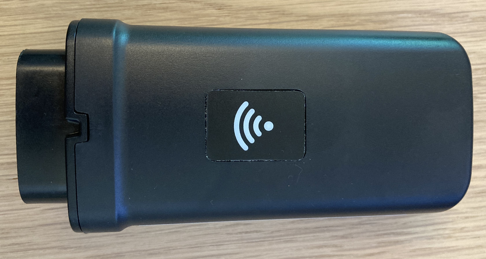
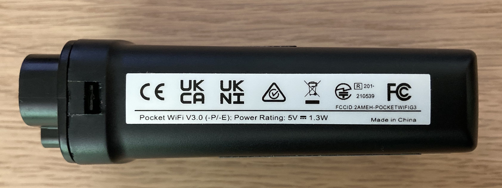
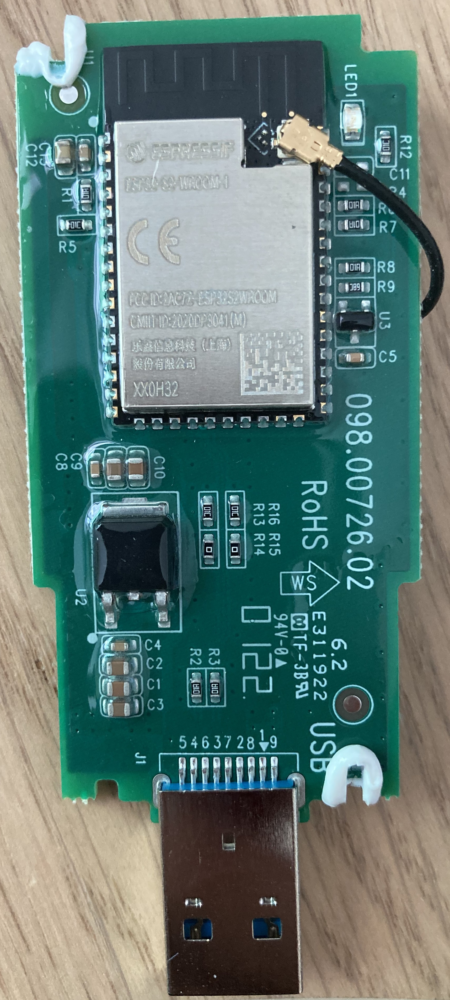
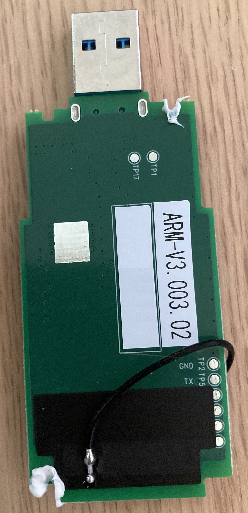

# Solax-Pocket-Wifi-V3.0-Hack

Reverse engineering of the Solax Pocket Wifi V3.0 (and V3.0-P) Dongle

   
  

# Mission

The goal is to use the original Pocket Wifi Dongle with an alternative Firmware for e.g.: 

- private use without the chinese cloud connection

- local monitoring without internet access

- direct logging in your own database (e.g. InfluxDB)

- zero power injection (e.g. with a Shelly 3EM energy meter instead of Solax SDM230)

- and may be some more fun stuff...

****

# Hardware

## <a id="schematic"><a>Schematic

A draft of an *incomplete* schematic can be found here: [PDF](https://github.com/Svenson84/Solax-Pocket-Wifi-V3.0-Hack/blob/main/Hardware/Schematic/Pocket_WiFi_V3.0.pdf)
The original [SCH](https://github.com/Svenson84/Solax-Pocket-Wifi-V3.0-Hack/blob/main/Hardware/Schematic/Pocket_WiFi_V3.0.sch) was create in *Cadsoft EAGLE v5.12*.

## Controller/WiFi

The original Dongle is using an ESP32-S2 with an "external" antenna as basis.
The antenna can easily be replaced by a more powerful version, e.g. similar to the V3.0-P Dongle.

  
  

## USB Connector

Despite the old Wifi Dongle, the V3.0 is using USB3.0 as pyhsical connector, but same as the old Dongle (V2.0), it uses only a UART transmission. 

The pinning between the Dongle V2.0 and V3.0 is not compatible! The pinning is documented in the [schematic](#schematic).

## Programming/Debug Port

The Pocket Wifi V3.0 PCB provides test pads for connection of a programming adapter.
Using a USB to UART (3,3V TTL) Adapter, e.g. ESP Link with following connection:

| ESP-Link | PocketWifiV3.0-PCB                           |
|:--------:| -------------------------------------------- |
| `3V3`    | `TP3 (3.3V)` *see [Flashing 3)](#flashing3)* |
| `TXD`    | `TP5 (TX)`                                   |
| `RXD`    | `TP4 (RX)`                                   |
| `GND`    | `TP2 (GND)`                                  |
|          | **and/or** `TP6 (GND)` *optional*            |
|          | **and** `TP7 (IO0)` *mandatory*              |
| `EN`     | not connected                                |
| `RST`    | not connected                                |
| `IO0`    | not connected                                |
| `IO2`    | not connected                                |

 ****

# Software

The Pocket Wifi V3.0 Donge is using the same UART protocol as the Pocket Wifi V2.0 Dongle, see: [xdubx/Solax-Pocket-USB-reverse-engineering](https://github.com/xdubx/Solax-Pocket-USB-reverse-engineering).

## Example Code

Some Arduino example projects are provided:

### Minimal Example

An [Arduino project with minimal code](https://github.com/Svenson84/Solax-Pocket-Wifi-V3.0-Hack/tree/main/Arduino/SolaxWifi_minimal) is providing the following content:

- UART communication to inverter (only: request and decode inverter data)
- OTA Programming (after initial flashing)
- WiFi connection via WifiManager
- Webserver providing HTML and JSON of decoded Inverter Data

### Extended Example

*in work* The **Minimal Example** will be extended by a diagram to visualize the power curve of the actual day. In addition a function to write the data in to a InfluxDB will be added.

### Zero-Injection

*in work* The **Extended Example** will be updated with cyclic reading of total power from a Shelly 3EM energy meter and an RS485 interface to simulate a Solax SDM230 energy meter. Zero injection to the power net will be possible! For this example a hardware modification will be necessary!

## Flashing

### 1) Install Arduino ESP32-S2 Board Support Package:

Detailed How-To: https://learn.adafruit.com/adafruit-metro-esp32-s2/arduino-ide-setup-2)
Short How-To:

1. start Arduino IDE and open **File** &rarr; **Preferences**
2. add `https://raw.githubusercontent.com/espressif/arduino-esp32/gh-pages/package_esp32_dev_index.json` in text box **Additional Boards Manager URLs**
3. open **Tools** &rarr; **Board** &rarr; **Board Manager**, search "*esp32*" and install latest esp32 package from Espressif Systems for ESP32-S2 Dev Board.

### 2) Connect HW and start into flash bootloader mode:

To enter the flash bootloader mode, pin `TP7 (IO0)` of the PocketWifiV3.0-PCB needs to be connected to `GND` before voltage is applied to the system.

> You can short `TP7 (IO0)` and `TP6 (GND)` with a jumper and only connect `TP2 (GND)` to the ESP-Link.

### 3) Apply supply voltage:

e.g. by plugging ESP-Link adapter into a USB port. Alternative apply `+5V` to PocketWifiV3.0-PCB via USB connector! In this case `3V3` of ESP-Link must not be connected! 

> **Attention**: DO NOT plug the PocketWifiV3.0-PCB into a regular USB port of your computer!!! It does not support USB communication. It might damage the ESP on your PocketWifi-PCB.

### 4) Read out OR flash firmare!

For read out, please see command line for `esptool.py`/`esptool.exe` below.
Remark: For windows the esptool can be found here: `C:\Users\%USERNAME%\AppData\Local\Arduino15\packages\esp32\tools\esptool_py\`

#### Read out firmware:

`esptool.py --port COM3 --baud 921600 read_flash 0 0x400000 solax.bin`
or
`esptool.exe --port COM3 --baud 921600 read_flash 0 0x400000 solax.bin`

#### Write/restore firmware:

`esptool.py --port COM3 --baud 921600 write_flash --flash_mode dio --flash_freq 80m --flash_size detect 0x0 solax.bin`
or
`esptool.exe --port COM3 --baud 921600 write_flash --flash_mode dio --flash_freq 80m --flash_size detect 0x0 solax.bin`

For flashing a firmware the esptool or the Arduino IDE can be used. 
For Arduino IDE select correct Board: `ESP32S2 Dev Module` and COM-Port of the ESP-Link. 
After flashing the new firmware also OTA-Flashing via IP can be used.

### 5) Remove connection with ESP-Link and Plug PocketWifiV3.0 Dongle into the USB Port of the Solax Inverter.

You can keep `GND`, `TXD` and `RXD` connection with ESP-Link and use a Serial Monitor to monitor debug information for serial interface UART0.

> For monitoring the debug interface UART0 while the Dongle is plugged in and powered by the Inverter, the `3V3` line must not be connected to ESP-Link!

### 6) Done! The PocketWifiV3.0 dongle is ready to use now!